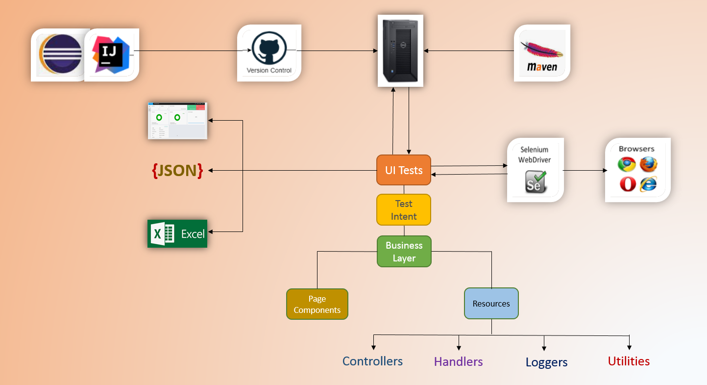

## Automator


[][license]

###  :earth_asia: Introduction
Automator is an Web UI Test Automation framework created using Selenium WebDriver and TestNG (configured to use dynamically created TestNG xml files) with reporting configured for ExtentReport, Excel, JSON and with Database (MySQL) integration.



***

###  :computer: Supported JDK Version
Preferred JDK version to use - **_JDK8_**.

***

###  :wrench: Setup & Tools
* Maven
* JDK (Java Development Kit)
* Eclipse (or any other Java IDE)
* Set Environment variables      
    * JAVA_HOME: Pointing to the JDK folder\bin
    * MAVEN_HOME: Pointing to Maven directory\bin.

***
	
###  :running: Getting Started
```sh
$ git clone 
$ cd 
$ import project from Eclipse as a maven project
```
***

###  :wrench: Built With

* [Maven](https://maven.apache.org/) - Dependency Management

***

###  :pencil: Author

* **Sumon Dey** - *Initial work* - [sumon-dey](https://github.com/sumon-dey "Sumon Dey") 

>Keep Smiling and Practice Hard 

[license]: https://opensource.org/licenses/Apache-2.0


